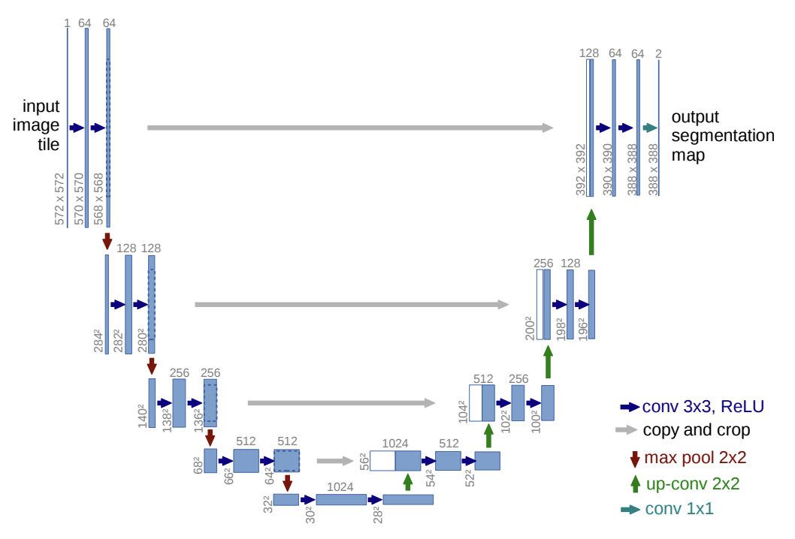
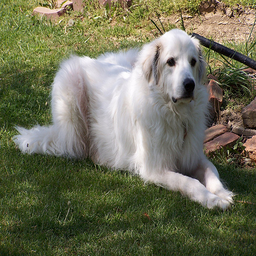

# UNet Segmentation with PyTorch Lightning

This repository contains a PyTorch implementation of a UNet model for image
segmentation task of the Oxford Pets Dataset.

Original UNet paper [U-Net: Convolutional Networks for Biomedical Image
Segmentation](https://arxiv.org/pdf/1505.04597) defines a fully convolutional
network architecture that consists of a contracting and an expanding path.
Contracting path repeatedly applies convolutions and downsampling, and
expansive path does upsampling with convolutions on features that are
concatenated with those from the contracting path. Thus, upsampling path has
high-resolution features that help localize and segment objects in the image.




This implementation uses PyTorch Lightning for training and evaluation, and
provides scripts to export the trained model to ONNX format for further
deployment.

## Setup

1. Create a virtual environment and install the required packages:
    ```bash
    uv venv && source venv/bin/activate
    uv sync
    ```

3. Download [Oxford Pets Dataset](https://www.robots.ox.ac.uk/~vgg/data/pets/) and extract archives into `data/` folder.

4. Configure config.json file with appropriate hyper-parameters and paths. Optionally set up wandb logging and provide your API key in .env file. See .env.example for reference.

5. Training

To train the UNet model, run the following command:

```bash
uv run python -m src.main config.json
```

This will start the training process using the configurations specified in `config.json`. 

6. Exporting to ONNX

After training, you can export the trained model to ONNX format using the following command:

```bash
uv run python scripts/ckpt_to_onnx.py --checkpoint save_dir/unet-final.ckpt

```

## Test

### Test locally

Optionally download a pre-trained model (trained for 200 epochs on A100 40GB from DataCrunch):

```bash
curl -L -o save_dir/model_unet.onnx https://huggingface.co/rus9/unet/resolve/main/model_unet.onnx
curl -L -o save_dir/model_unet.onnx.data https://huggingface.co/rus9/unet/resolve/main/model_unet.onnx.data
```

Build the Docker image with FastAPI inference application and run the container:

```bash
docker build -f docker/Dockerfile.local -t unet-inference .
docker run --rm -p 8080:8080 unet-inference
```

Prepare an input image and send a request to the running service:

```bash
curl -X POST "http://localhost:8080/infer" \
  -H "Content-Type: multipart/form-data" \
  -F "file=@data/images/great_pyrenees_74.jpg" \
  --output mask.png
```

<p float="left">
  
  
</p>

